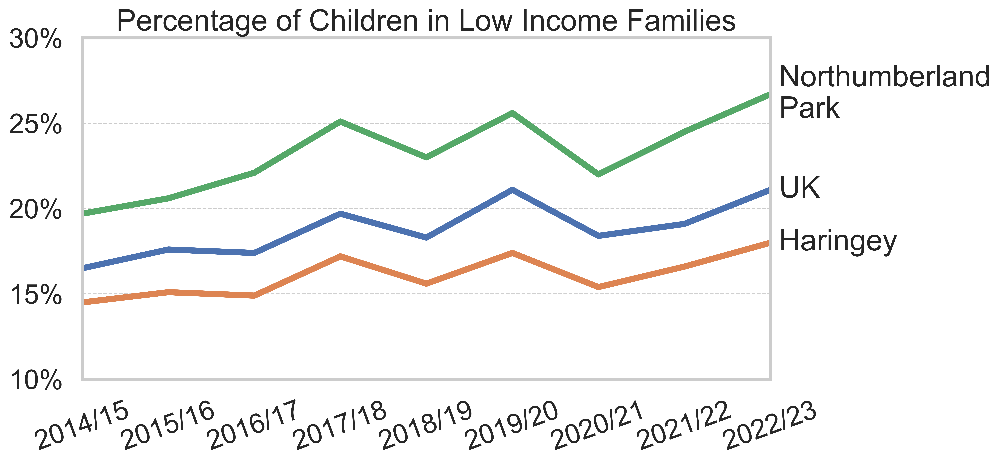

\*Named Authors are presented in alphabetical order

This report is licensed under a Creative Commons Attribution 4.0 International License (CC BY 4.0). You are free to share, copy, redistribute, adapt, remix, transform, and build upon this material for any purpose, including commercially, provided you give appropriate credit to the authors, provide a link to the license, and indicate if changes were made.

To cite this report: \[Authors\] (2025). Understanding Poverty in Place: Where Data Meeting Community in Northumberland Park. London: \[Publishing organisations\]. Available at: \[URL\]

Note on data sources: This report incorporates secondary data from various sources, each governed by their own respective licenses and terms of use. These include but are not limited to:

-   Children in Low Income Families data (Department for Work and Pensions) - Open Government Licence
-   English Indices of Deprivation (Ministry of Housing, Communities and Local Government) - Open Government Licence
-   Census data (Office for National Statistics) - Open Government Licence
-   Energy Performance Certificates (Department for Levelling Up, Housing & Communities) - Open Government Licence

Users reusing data from this report should verify the licensing terms of the original data sources. The CC BY 4.0 license applies to the original analysis, interpretation, and written content of this report, but does not override the licenses governing the underlying datasets.

Copyright for participant quotes and personal testimonies remains with the individuals. Their inclusion in this report does not transfer copyright.

For more information about the Creative Commons Attribution 4.0 International License, visit: <https://creativecommons.org/licenses/by/4.0/>

# Executive Summary

In the UK, 4.5 million children live in poverty, and despite decades of data and interventions, the problem persists. This project asks why? Using the Data Democracy approach - centring the voices of those with direct lived experience in the interpretation of data - we worked with residents of Northumberland Park, one of England's most deprived areas, to understand poverty affecting children[^1] in depth.

[^1]: At the inception of this project, we used the term ‘Child Poverty’. From our discussions with residents of Northumberland Park, it became clear that this term is somewhat of a misnomer since children themselves cannot be poor in the usual sense because they cannot earn money. Residents expressed a preference for the term ‘Poverty Affecting Children’ because this framing highlights the fact that children’s poverty status is determined by their household circumstances – e.g. their parents’ or guardians’ economic situation – and thus avoids the inference, implicit in the term ‘Child Poverty’, that children themselves have some agency over their poverty status.

## What We Did

We worked with residents of Northumberland Park, Tottenham, where 27% of children live in poverty. Between May and October 2025, we conducted five workshops with younger residents (aged 16-30), who examined statistical patterns, connected them to lived experience, and guided our analysis of publicly available data.

## What We Found

**Northumberland Park sits within a borough starkly divided by wealth.** In east Haringey, up to 1 in 3 children live in poverty; in the west, as low as 1 in 33, a tenfold difference. Residents described crossing this divide as entering "a simulation," two incompatible worlds separated by differing levels of wealth, infrastructure, and opportunity. When data is aggregated at borough level, the deprivation in Northumberland Park becomes invisible, disappearing behind averages that mask the crisis.

**New Indices of Deprivation data, released during this project, quantifies what residents already knew: conditions have worsened since 2019.** Northumberland Park has dropped from 485th to 41st most deprived in terms of Income Deprivation Affecting Children. Almost all other measures of deprivation in Northumberland Park have also worsened. This is the case despite the multi-million-pound redevelopment of Tottenham Hotspur Stadium right next door.

**The stadium's development exemplifies a form of extractive regeneration.** Haringey Council allowed the club to renege on a range of planning obligations, including social housing provision and local employment and education support – and relaxed event regulations such that the stadium now hosts double the number of non-football events than was originally agreed. According to residents, most of the economic benefit remains captured within the stadium, while food banks operate during concerts and other events just metres away.

**Race and class intersect in complex ways.** Within the estate itself residents identify primarily by class. Shared material conditions, social housing, neglected infrastructure and limited opportunities create solidarity across ethnic lines. One participant described a "vibration" within the area that unites more than ethnicity divides. Yet the geography itself remains fundamentally shaped by structural racism: who lives in Northumberland Park, and why, reflects the history of discriminatory housing and labour market policies.

**Institutional failure continues to perpetuate these conditions.** Residents feel Haringey Council possesses the data but fails to take meaningful action. Furthermore, philanthropic funding operates on short cycles fostering dependency rather than sustainable change.

## What Must Happen Now

Residents have developed important ideas about how things can change for the better. Their provocations, developed through rigorous engagement with data and lived experience, include:

-   Shifting from child-focused to family-focused intervention - recognising that children’s welfare is bound to their parents’ welfare.
-   A Northumberland Park endowment fund, capitalised by those who profit from the area and others invested in its future
-   Using this fund to invest in people and community capacity for the long haul, not short-term projects
-   Transparency and direct engagement from institutions that make decisions affecting their lives

Poverty affecting children persists not from lack of data or knowledge, but from a lack of political will. Those with power to change the system don't experience its failures directly enough to compel urgent action. Affected communities have always known what needs to change. This research demonstrates that residents are expert interpreters capable of sophisticated analysis - their recommendations deserve serious response. The question isn't what should be done. The question is whether those with power will finally choose to act.

# Introduction

> “Q: You see how there’s a distinct divide, do you feel like the they done that on purpose, cos like it’s so obvious. Like the divide in wealth in Haringey.
>
> A: Could they do it on purpose to fix it? That’s the question”

In the UK, 4.5 million children live in poverty and approximately 1 million children are experiencing destitution. In addition, 2.2 million children qualify for Free School Meals [@noauthor_growing_2025]. Moreover, poverty affecting children is unevenly distributed along racial lines, with Black and Minority Ethnic children about three times as likely to be affected by the two child benefit cap compared to White children [@stewart_baking_2025].

As these figures demonstrate, there is no shortage of data and statistics on poverty affecting children. Despite the long-established knowledge-base on the issue, things have only become worse. The persistence of poverty affecting children raises critical questions about whether current policy approaches are effectively addressing the problem.

One possible explanation for this failure is that policymakers may be fundamentally missing the mark by designing interventions based on what they believe to be important (based on numerical data) rather than what genuinely makes a tangible difference to the daily lives of struggling families. A crucially important and all too often overlooked source of information on what needs to happen is the people who have direct experience of living in poverty. This disconnect, between policy intentions and lived realities, suggests that reducing poverty affecting children may require a fundamental shift in approach, one that centres the voices and experiences of those directly affected.

Our work seeks to address this gap by placing the lived experiences of people living in poverty at the heart of our research. We do this by engaging directly with communities to understand what matters in their daily lives and what changes would make a difference. This approach recognises that those with direct experience of poverty are the experts on what support they need, and that lasting solutions must be built on this foundation, rather than guesswork from a distance.

# This Project

This project is a collaboration between Residents of Northumberland Park, [Place Matters](https://www.placematters.org.uk/), [Just Knowledge](http://justknowledge.org.uk/), [Roots and Rigour](https://rootsandrigour.org/) and [North London Partnership Consortium (NLPC)](https://nlpcltd.com/) and funded by the [Joseph Rowntree Foundation (JRF)](https://www.jrf.org.uk/).

We each share a commitment to tackling the root causes of inequality and social injustice in communities. We share the view that the use and misuse of 'data' and interpretations thereof exclude marginalised groups and serve to legitimise and maintain the status quo.

We have committed to doing research that centres the people whose lives and experiences the data represents. We recognise that our current conceptual resources are often inadequate for solving major social challenges like poverty affecting children. Consequently, in this project and our work generally, the funded organisations adopt a method, which we call ‘Data Democracy’. The approach is relatively simple at a high level - we provide communities with high-quality data analysis connected to their own interests and observations. Then we work together to interpret what the data means. Data doesn't speak for itself, it requires human interpretation and communities[^2] bring essential context, concepts and common sense that researchers consistently miss.

[^2]: We also recognise that ‘community’ can be used as a catch-all term which, if used too loosely, ultimately loses its meaning. In this project ‘community’ is closely tied to place, and consequently unique places face unique challenges requiring unique understanding and action.

In this project, we aimed to understand poverty affecting children in Northumberland Park, an estate in Tottenham in the London borough of Haringey. Northumberland Park is one of the most deprived areas in England, ranking 131st most deprived out of 6,857 areas (Middle layer Super Output Areas; MSOAs) on the Index of Multiple Deprivation (Ministry of Housing, Communities and Local Government, 2025).

It is also remarkably diverse. Around 55% of residents weren't born in the UK, and the community includes Black (38%), White (33%), Asian (8%), Mixed (7%), and other ethnic groups (14%). In 2023/24, approximately 27% of children were affected by poverty - placing Northumberland Park in the bottom (worst) 10% of all London areas.

At the outset of this project, we planned to deliver four community workshops between May and October 2025 to explore poverty affecting children and its relationship with ethnicity. These in-person workshops had four core purposes:

1.  Share existing data with community members and organisations
2.  Help participants understand the available information
3.  Gather their perspectives on what the data means
4.  Identify what additional data is needed to fully understand the lived reality of children and families affected by poverty

Following these workshops, we hosted an open-invitation webinar, to share our findings with a broader audience beyond the locality.

As readers will note from our findings, the data democracy approach, when followed faithfully, is incompatible with strict adherence to predetermined research questions, thus as you will see our discussion went well beyond ethnicity and, what we did understand about ethnicity was not what we expected. This report is the collaborative culmination of that work.

# Listening Differently - The Data Democracy Method

Our mixed methods approach is rooted in the acknowledgement that quantitative data can support any number of interpretations, and that interpretation is shaped by the interpreter’s perspective and experience [@teo_what_2010]. When it comes to issues of social policy, the knowledge and action arising from data is therefore shaped by who is in the position to interpret them, and this position is often occupied by people with perspectives and experiences that are not the same as those of the people with direct experience of the issue. Consequently, the knowledge derived from data often does not truly represent the reality of experience. Interventions based on this incomplete knowledge can fall short of addressing the needs of the communities the data concern.

We use the term Data Democracy to describe the novel approach we have developed to address this shortcoming in social policy. In this approach, the people with direct experience of the issue lead the research and knowledge-production process; they are responsible for asking the questions, interpreting the data and co-creating the solutions. Our role is to use our methodological expertise to gather the data they need. In this way, the existing data is analysed and understood from the perspective of experts by experience, and with this new knowledge, derived from both quantitative and qualitative interrogation, communities and policymakers are better positioned to make long-lasting, meaningful change that promotes social justice.

In practice, the Data Democracy approach is an iterative process of community discussion and data analysis. Although preexisting research, theory and knowledge may shape the initial direction, the substance of the work is malleable and changes with interests of the community. The first session of a community engagement is designed for listening. In this session, the aim is to hear about the issue as experienced by the community. This qualitative process lays the foundation for everything that comes next and, critically, is shaped not by us as the ‘researchers’, but by the members of the community, who themselves are researchers in this process.

Our approach to quantitative analysis is initially light touch; we seek to produce descriptive statistics so as not to skew interpretation through analytical decisions. More complex analysis may follow in later iterations as the discussion develops. In this case, our subsequent meetings therefore involved a mix of presenting the data we sourced to participants and hearing their interpretation of it and what it means in their context. As an organic process, some lines of inquiry may go stale while others develop and evolve, leading to further and more complex questions that we seek to understand through the integration of quantitative and qualitative data.

Throughout the Data Democracy process, we pay attention to how the insights produced from the process can lead to change. By the end of the process, this ‘so what’ thinking culminates in a set of actions and/or recommendations that are communicated to relevant stakeholders and the wider community. These actions and recommendations are of course determined by the community members involved in the process, and represent priorities as judged by the people best positioned to articulate them, both by virtue of their direct lived experience as well as their interrogation of the available secondary data.

## Participants

We reached out to residents of Northumberland Park via the NLPC to invite interested parties to participate in the project. The invitation was to participate in paid workshops (\~£16.66 per hour) to discuss, understand and interpret data on ‘child poverty’ and to generate new data on the topic from their lived experience.[^3] The invitation was extended to people who lived in Northumberland Park (or surrounding areas) and were 16 years old or older. Four workshops were conducted in person at the Neighbourhood Resource Centre (NRC) in the heart of Northumberland Park, and one workshop (Workshop 4) was conducted online. We aimed to meet with residents at one-month intervals from May to October 2025.

[^3]: See [Appendix 2](#appendix-2) for the flyer sent out to canvas for participants.

From the initial canvas over 20 residents expressed interest, and 17 residents participated in Workshop 1. We purposefully intended to cast a wide net to generate interest in the project. Residents were a mixed demographic group broadly representative of the make-up of the neighbourhood. In subsequent workshops we invited back a smaller group of 9, mainly younger (16 to 30 years old) residents. We chose to work with this smaller group in subsequent workshops to enable deeper, more sustained engagement. Focusing on younger residents reflected our interest in understanding how poverty shapes experiences during adolescence and our recognition that a peer-based group could facilitate more open dialogue and collective analysis.

## Qualitative Approach

The qualitative aspects of the data democracy approach can be described as a serial focus group design [@baden_serial_2022].[^4] This structure allows participants to create social relationships across multiple meetings, learn from one another and generate shared representations, knowledge and collective ownership over both the research questions and the interpretation of findings. Within focus group sessions, data or other artefacts are used as a stimulus [@nind_creative_2016] to generate discussion and joint interpretation. The data presented would typically be generated from participants own hypotheses or questions from previous sessions, creating an iterative cycle of inquiry. Discussions involved understanding the data through lived experience perspectives, generating explanations for why patterns emerged as they did, and evaluating potential remedies. This positioned participants not as data subjects but as active interpreters capable of connecting quantitative patterns to structural processes and collective experience.

[^4]: Broadly referred to as ‘workshops’ throughout this document and in communication with participants.

The focus groups were recorded and transcribed. These transcriptions are then coded using reflexive thematic analysis [@braun_using_2006; @braun_toward_2023] focusing on both semantic and latent meaning. Coding was purely inductive, and given the nature of the methodology, no specific theoretical or empirical concerns could guide an a priori deductive approach in this instance.

## Quantitative Approach

Based on the content of the discussions with participants, we analysed secondary datasets relevant to the topics discussed. All data processing and analysis conducted by Just Knowledge can be found in Just Knowledge’s Poverty Affecting Children repository on GitHub.[^5] Our analysis makes use of a wide range of publicly available data. For technical detail about these datasets and how they are used see [Appendix 4](#appendix-4).

[^5]: <https://github.com/JustKnowledge-UK/jrf-poverty-affecting-children>

# What We Found

## The Wrong Side of the Tracks - Spatial Inequality and Invisibility in Haringey

The London Borough of Haringey, where Northumberland Park is located, is strongly divided in terms of wealth. In the East of the borough, the level of poverty affecting children is very high, with up to 1 in 3 children living in poverty. In contrast, in the West of the borough, the rate is as low as 1 in 33 - ten times lower. This spatial divide is felt directly by residents and was intuited prior to any data visualisation being shared.

> “And you can actually see that, like, if you go to Wood Green and you pass a certain place, you already know, like it feels different… like when you come to the east part of Haringey from coming through the West, it's as if you're in a simulation. It actually feels like you're in two different worlds.”

These perspectives were clearly supported by geospatial data we prepared for participants showing the Children in Low Income Families (CiLIF) data for Haringey by Middle layer Super Output Area (MSOA), shown in @fig-1. The Figure illustrates the stark distinction between the East and West of Haringey. On average, 22% of children in the east of Haringey are living in poverty, while in the west the figure is 7%.[^6] Northumberland Park is highlighted in the farthest north-east of the map.

[^6]: East and west are here defined by the East Coast Main Line railway splitting the borough (red line in @fig-1), which was described by participants as the point at which the ‘two worlds’ meet, especially in the area around Alexandra Palace.

{#fig-1}

This inequality was evident temporally as well as spatially. @fig-2 shows the CiLIF data over time in the UK, Haringey and Northumberland Park. These data enabled conversations about how different levels of aggregation mask lived experiences, given that Haringey has much lower levels of poverty affecting children than the UK average. Participants recognised the potential for statistical sleights of hand:

{#fig-2}

> “The separation between Northumberland Park… like these young people are struggling at a staggering rate and then Haringey looking okay. Sometimes, if you don't zoom into certain streets, you won't see the pain people are facing. And you can put data to make things look nice”

Here participants noted not only that when looking at Haringey overall the rates of poverty affecting children are lower than the UK average, but also that the rate of increase over the past few years has been steeper for Northumberland Park compared to Haringey and the UK. Through this discussion participants expressed feelings of abandonment and neglect, questioning whether the geographic concentration of deprivation was accidental or intentional:

> “My street is like poverty, like council flats. You're gonna see stabbings all the time. If you do a five-minute walk, all the houses are kind of okay, and the poverty is a bit less. Haringey is designed that way.”
>
> “I have a question, like you see how there’s a distinct divide do you feel, like the they done that on purpose, cos like it’s so obvious. like the divide in wealth in Haringey… it can’t just coincidently happen like that”

The phrase “designed that way” suggests more than geographic happenstance, it points to a reading of space as produced and maintained through policy choices, investment decisions, and structural neglect.

Participants described Northumberland Park as simultaneously hyper visible and invisible. The Tottenham Hotspur Stadium dominates the skyline, drawing thousands of visitors on match days, yet the estate itself remains unseen. In our initial mapping exercise (Workshop 1, @fig-3), people were asked to identify landmarks and boundaries that defined their neighbourhood. The stadium emerged as a powerful symbol of this paradox, a structure that brings the world's attention to the area while obscuring the lived realities of those who call it home:

> “Come into Northumberland Park, you see the stadium and then you start walking behind that’s when you start to see all of us and see... all the building\[s\] and all the blocks and you just see the estate... it's just massive.”

{#fig-3}

The estate exists in the shadow of development, both literally and figuratively. While investment flows toward infrastructure that serves those passing through, participants described the total neglect of the infrastructure intended for residents:

> “They've let it just rot, like, physically speaking, they've let the estate rot.”

Perhaps the most visceral articulation of Haringey's spatial inequality came through descriptions of certain bus routes, which traverse the borough from east to west. Participants described this journey as an embodied experience of crossing from one world into another, where the material markers of wealth and poverty become increasingly pronounced:

> “If you go to \[on the\] W3 and just go from… Northumberland park here all the way to… Finsbury Park, you'll see what I mean…It will go through the whole estate, you'll come out to the big, shiny stadium… once you get to that little peak, and you see, like, Ally Pally, that's when you start coming into, ‘Oh, wow.’”
>
> “The bougie really sets in once it goes down that hill. And now you start seeing, ‘oh, we have these type of people in our area’ that actually, you know, live good. They live nice. They're houses look nice. They have, there's trees, you see what I mean.”

The journey is not just geographic but also social and symbolic. Trees, well-maintained homes, different types of shops, become markers of who belongs where, and whose needs are prioritised. The contrast is not subtle; participants described it as jarring, “as if you're in a simulation.” This language suggests an artificial quality to the division, as though someone had drawn a line separating two incompatible realities.

The geographic concentration of deprivation in Northumberland Park operates as a form of strategic invisibility; poverty is sequestered into specific boundaries, not captured by borough level statistics. But those living within these boundaries experience compounding disadvantage related to income, housing, access to services and more. The divide ultimately determines who is expected in what places, who is heard and valued by the state and the opportunities available to people on each side of the ‘tracks’. Through our data exploration participants recognised that there was potential for their experiences to be averaged out, smoothed over, and rendered statistically ‘insignificant’ when aggregated with wealthier areas, perhaps enabling continued neglect, disinvestment and the normalisation of conditions which are unacceptable elsewhere.

## More than Skin Deep - Race, Class and Solidarity

We entered this research seeking to explore ethnic disparities in the experience of poverty affecting children in Northumberland Park. The relationship between race and poverty is well-documented nationally - both historically [@platt_poverty_2007; @platt_ethnicity_2009] and contemporarily [@matejic_bangladeshi_2024; @stewart_baking_2025] - with children from Black, Asian, and other minoritised ethnic backgrounds experiencing significantly higher rates of poverty than their White peers (see @fig-4).

{#fig-4}

Given this evidence base, and Northumberland Park’s diverse (predominantly Black) population, we anticipated that race would emerge as a primary lens through which participants understood and articulated their experiences of poverty and inequality.

Initial reactions to questions about demographics appeared to confirm these expectations. When we asked participants to describe the people they encountered when crossing into wealthier areas of Haringey, the responses were immediate and pointed:

> I: “What kind of people? What do the people look like when you go down the hill?”
>
> P1: “Not our colour”
>
> P2: “Predominantly White”

This exchange seemed to be setting up the discussion we expected about racialised inequality, where Whiteness is synonymous with wealth. Yet as the conversation deepened, what emerged was far more nuanced than a straightforward story of racial division.

Northumberland Park sits within Tottenham, one of London's most ethnically diverse areas (@fig-5).

{#fig-5}

This diversity is not merely statistical; it is lived, felt, and articulated by participants as central to the area's identity:

> “We have all types of cultures here... you can find the whole world in Tottenham... here the ethnicity aspect is not as glaring, until you go on to the other side.”

Rather than ethnic segregation or tension, participants described a form of solidarity built on shared material conditions:

> “There's a mix of ethnicity in Northumberland Park, but the vibration in the entire area is the same. White, Black, Turkish, whichever race, everyone has suppression, low, low moods, low like, no opportunity, control from the government, etc... it's very different compared to other areas.”

This statement is striking in its universalism. The speaker does not differentiate between ethnic groups in describing the “vibration” of the area, instead, poverty itself becomes the unifying characteristic. The language of “suppression” and “control from the government” suggests a shared structural position, a common relationship to power that transcends ethnic difference.

This solidarity extended to White residents, who participants were careful to distinguish from the “predominantly White” populations in wealthier areas. Working-class White youth in Northumberland Park were not seen as part of the privileged demographic encountered “over the hill,” but rather as fellow community members who shared the same struggles:

> “White kids... working class White people... They speak how we kind of speak, like on roads, like they speak with slang... They're basically like us. They just happen to be White. They experience similar circumstance... they understand how it is here.”

The contrast being drawn is not between White and non-White, but between working-class and middle-class, between “here” and “there.” The complexity of how race and class intersect became most apparent in an extended discussion about parenting groups and social exclusion. One participant, reflecting on their experiences of attending playgroups in wealthier areas, described encountering class-based barriers that operated independently of, and sometimes across, racial lines:

> “You go to baby groups, and you expect everybody… be like, ‘Hi’. No. There's cliques… And then the others that are on the outskirts of that room, like, where do I fit in?”
>
> “The same way that you could feel isolated by a White middle-class mum in that group, same with a Black middle-class woman in that group. Because they've made that transition, and they're not gonna jeopardise that by being the friendly face.”

This observation disrupts simplistic narratives about racial solidarity or shared identity. A Black middle-class mother, having “made that transition” into affluent spaces, may be just as exclusionary as a White middle-class mother. Class position, in this context, shapes behaviour and affiliation more powerfully than racial identity. The fear of being “ostracised” for crossing class boundaries, for being “the friendly face” to those outside the clique, reveals how precarious belonging can be in middle-class spaces, and how vigilantly those boundaries are policed.

While class emerged as the primary identification within Northumberland Park, participants were also keenly aware of the racialised processes that had concentrated poverty, and particular populations, in their area. Discussions about migration patterns revealed an understanding of how structural inequalities shape where people can live:

> “Where people migrate to the UK, or like, migrate to London, specifically... they want to move to places where it's cheaper and most of the housing was cheaper where there's more poverty... So the more people, the more immigrants that move to the more deprived areas... it's gonna boost poverty even more, because more people, less funds.”

This analysis connects migration to housing costs, and both to the perpetuation of poverty. It also gestures toward historical patterns and the ongoing parallels between contemporary and historical migration:

> “There's the Imperial relationship... who were the migrants 50 years ago, aren't migrants now... they kind of started to look different, but the circumstances are very similar.”

Corroborating these points, directed by participants we explored house pricing across Haringey over the past twenty years. @fig-6 shows house prices by decile, benchmarked to London overall, for Output Areas in 2023. It shows that all 21 Output Areas in Northumberland Park fall into the bottom four deciles for house prices in London, with 10 of these areas (48%) falling into the bottom decile. @fig-7 shows how the picture has changed since 2000. It shows that house prices in 2023 for most of the estate remain in the same position relative to London overall as they were in 2000. In addition, one area of Northumberland Park has dropped a decile; that is, the house prices in this area relative to the rest of London are lower in 2023 than there were in 2000.

{#fig-6}

{#fig-7}

What emerged from these discussions was not the erasure of race, but a more complex picture of how race and class intersect in a context of concentrated poverty. Race matters profoundly. The population of Northumberland Park is predominantly non-White, and this is not coincidental. Historical and ongoing processes of racialised exclusion, discriminatory housing policies, and labour market inequalities have shaped who lives where [@finney_which_2015; @rex_race_1967]. The “simulation” participants described crossing into is not just a wealth gradient; it is a racialised geography, produced through decades of systemic inequality.

However, within Northumberland Park itself, the primary lived identification is class-based. Shared material conditions, living in social housing, navigating the same neglected infrastructure, facing the same limited opportunities – create bonds that cross ethnic lines. The “vibration” of poverty unites more than ethnicity divides.

These findings have important implications for how we think about intervention and support. While it is essential to acknowledge and address the racialised processes that have concentrated poverty in areas like Northumberland Park, responses that focus solely on ethnic identity without attending to class position may miss the mark. Participants themselves signal that place-based interventions, approaches that address the shared material conditions of all residents in deprived areas, may be more appropriate than identity-targeted programmes that differentiate between ethnic groups experiencing similar circumstances.

At the same time, we must resist the temptation to imagine that class solidarity renders race irrelevant. The fact that working-class residents of different ethnic backgrounds share experiences of poverty does not erase the specific forms of racism, discrimination, and marginalisation that Black, Asian, and other minoritised communities face. What participants are describing is context-specific: within the bounded geography of Northumberland Park, class is the more salient axis of identification. But that geography itself, who lives there, why they live there, and how they are treated by those outside, is fundamentally shaped by race.

## Tottenham Hotspur Stadium and Extractive Regeneration

Northumberland Park is defined, in part, by what looms over it - the Tottenham Hotspur Stadium. Redeveloped and reopened in 2019 as one of the most technologically advanced sporting venues in Europe, with a capacity of over 62,000,[^7] the stadium dominates both the physical landscape and the local imagination. It is impossible to discuss poverty and inequality in Northumberland Park without reckoning with this structure; its promises, its failures, and the ways it shapes community life.

[^7]: <https://www.tottenhamhotspur.com/the-stadium/>

The stadium became a focal point in our data discussions as a test case for a fundamental question: can large-scale commercial development in deprived areas serve as a vehicle for regeneration? Or does it simply extract value while leaving existing residents behind?

There were many answers to this. For instance, one participant was highly sympathetic to the club both as a fan and as a young person benefitting from their community programmes:

> “for example… I started college a year later, and during the first year where I was meant to be in college, I did sessions… with Tottenham Hotspur, and it helped me find a college that I currently go to now, to do a course that I really like, to help me plan the whole application and interview process.”
>
> “So… from my experience, Tottenham Hotspur did help, like, they do a lot of charity work, and like, in terms of helping a young person find college or education”

However, as participants shared more of their experiences and we analysed data, a troubling picture emerged, one of regulatory capture, broken promises, and a model of development that treats local communities as collateral rather than stakeholders.[^8]

[^8]: These accounts are provided from the perspective of residents only. We provided Tottenham Hotspur with a copy of this report and invited their responses. Where these responses are included, we say so explicitly.

Perhaps nothing crystallises the disconnection between the stadium's operations and local needs more starkly than the image of food banks operating during Beyoncé concerts. One participant recalled:

> “She had one of her performances, and all the food banks were open. I remember walking because there was no buses... I was coming home, so I had to walk from the high road and around, and then there was the food bank.”

The juxtaposition is surreal, metres from where thousands of fans pay premium prices to see one of the world's biggest stars, local residents queue for emergency food assistance. The question emerged: is this normal? To answer this, we use the locations of Premier League stadia in London, and for each one quantified the CiLIF data for the areas within 1km.

We found that Tottenham Hotspur is an outlier. @fig-8 shows that most other London Premier League stadia are not located exclusively in the poorest areas of their respective boroughs. Instead, there is a more even distribution of poverty affecting children around the local authority average within a kilometre of the stadium or, in some examples, the stadia areas appear to be wealthier than the borough average (e.g. Brentford, Chelsea and Fulham).

{#fig-8}

But the relationship between the stadium and locals isn’t only about two worlds out of contact with one another. On the contrary, the stadium’s presence is strongly felt by residents. The disruption caused by major events – road closures, suspended bus services, restricted access to community facilities – falls most heavily on those with the fewest resources to absorb it:

> “It causes a lot of disruption... one of my children go to the Kung Fu just here. My other children attend the adventure playground where I work, and a lot of the time they are like, ‘we have to close tomorrow. We have to close because we have to rearrange because of the concert, the roads will be closed’. It's disruption. It's just too much.”

When major developments like the Tottenham Hotspur Stadium are proposed in deprived areas, employment opportunities for local residents are invariably cited as a key benefit, one which may override possible downsides. However, for the residents of Northumberland Park that we spoke with, there has been no perceived boost to employment opportunities:

> “They're creating jobs, but... yes, but also no. You're providing jobs but most of the jobs are people who aren't local... the local community sacrifices a lot for their sake and then the return is not equal.”

Although a recent report published by Tottenham Hotspur [@noauthor_club_2023] indicates that in 2021/22 the club supported 2,800 full time equivalent jobs in Haringey, it does not specify where in Haringey these workers came from. We asked the Club directly whether they have local employment and hiring targets and whether these targets are met but did not receive a response and so could not verify to what extent local residents benefit from employment opportunities at Tottenham Hotspur.

Beyond employment, residents made direct comparisons to the Emirates Stadium, the home of Arsenal Football Club in the neighbouring borough of Islington. In one extended example a participant shared how the two clubs differ in their approach to local communities. When the local roller-skating group was expelled from spaces around the Tottenham Hotspur Stadium, they found welcome at Emirates:

> “When the roller-skating community that was local got kicked out by Tottenham, Emirates accepted us. Emirates... installed lights that turn on at night... their lights turn on from 8 and keep it on till we leave, which is pretty cool.”

This is not merely symbolic. It represents a willingness to accommodate community use of stadium facilities, to see the area as shared space rather than private property to be defended against local residents. As one participant put it:

> “So instead of like taking away, they’re actually reinvesting... That's a mindset, which is a club saying this is what we're going to do.”

There was also an expectation that the stadium would stimulate the local economy, that the additional tens of thousands of people flowing into the area on event days would spend money in local shops, cafes, and restaurants. From the perspective of residents, this has not materialised:

> “If it's going to local businesses, or just going to the stadium... They're mostly spending that money when they're in the stadium, because you can't bring stuff in... and then when they go, they just go.”

We explored this line of reasoning using data on Gross Value Added [@office_for_national_statistics_uk_2025] and Tottenham Hotspur’s Financial Statements.[^9] GVA is a measure of economic productivity describing the value of goods and services produced minus the cost of producing those goods and services. We wanted to understand whether GVA in the area around Tottenham Hotspur Stadium has increased, and how much of that increase can be attributed to other businesses in the area. To do this we tracked the percentage change in GVA since 2016[^10] for the 1km area around Tottenham Hotspur Stadium[^11] and subtracted Tottenham Hotspur’s revenue and profit.[^12]

[^9]: <https://www.tottenhamhotspur.com/the-club/investor-relations/annual-reports/>

[^10]: We chose 2016 as the base year because the revenue of Tottenham Hotspur Football Club saw a sharp increase from 2017 onwards and we wanted to capture this trajectory in the context of the area’s GVA. See Appendices [4](#appendix-4) and [6](#appendix-6) for more details.

[^11]: This area included nine MSOAs, seven of which in Haringey and two in Enfield (see [Appendix 6](#appendix-6) for visualisation of the areas and [Appendix 4](#appendix-4) for why we used this collection of areas).

[^12]: We can only approximate Tottenham Hotspur’s GVA contribution and growth; the true value will lie somewhere between their revenue (orange line) and profit (green line). This is why we plot both in @fig-9 and why we cannot say with certainty that GVA has decreased in the area; the true value of growth excluding Tottenham Hotspur will lie somewhere between the green and orange lines.

@fig-9 shows the percentage change in GVA from 2016 in the Tottenham Hotspur Stadium (THS) area, other areas in Haringey, and London as a whole. It indicates moderate growth in the THS area (teal line). However, when we exclude Tottenham Hotspur’s revenue (orange line) and profit (green line), growth in the area around the stadium since 2016 is lower and flatter, and it is even possible that GVA has decreased.[^13] The implication is that much of the growth in GVA in the area is attributable to the club and not to local businesses. This analysis supports residents’ assessment that not only has the redevelopment of the stadium done little to stimulate growth for businesses in the area, but it also appears to have reduced their economic productivity.

[^13]: It is important to note that these values do not correct for inflation, so this is a generous estimate of growth; in reality, growth will be lower than these numbers suggest because any increases are partially attributable to inflation.

{#fig-9}

When we shared a draft of this report with Tottenham Hotspur, they alerted us to a business directory which is shared with ticket holders.[^14] The directory contains profiles of many Tottenham businesses, and appears to be a recent development – shared by Haringey council on LinkedIn in July 2025.[^15] It is possible that the fruits of this approach have not yet materialised. However, at this point, it is uncertain whether this directory will deliver the transformative economic benefits that Northumberland Park needs.

[^14]: <https://www.tottenhamhotspurstadium.com/media/ebelny5k/v10_dt_guide_doc.pdf>

[^15]: <https://www.linkedin.com/posts/haringey_as-part-of-our-ongoing-collaboration-with-activity-7351664542512205825-7g3B/>

Participants also described a “parachute” model of engagement: fans arrive, spend their money inside the stadium, and leave without interacting with the surrounding area. Participants theorise that the economic benefit is captured entirely by the club and its concession partners, while local businesses see little to no uplift. This explanation is compatible with the available data.

Nonetheless, the earlier comparison with Emirates raises further uncomfortable questions about choices and priorities. Why does Tottenham Hotspur Stadium operate as it does? Is it inevitable that such developments benefit shareholders rather than local communities? Or are these outcomes the result of specific decisions? Decisions that could have been made differently.

Participants suggested that the club's approach reflects choice, rather than constraint:

> “Tottenham are doing it for themselves... They're taking a different approach, because I feel like it both goes into reputation. That's why they take different approaches.”

If the issue is reputation and brand management, then the club has evidently calculated that its interests are better served by a particular model, one that prioritises commercial flexibility, standardised agency hiring, and minimal community obligation. The fact that Haringey Council appears to have facilitated this approach, relaxing regulations and forgoing housing requirements, suggests a failure of governance to protect community interests.

What might inclusive regeneration have looked like? At minimum:

-   Enforceable local hiring targets, ensuring that a significant proportion of stadium jobs go to residents of Northumberland Park and surrounding areas[^16]
-   Affordable community access to stadium facilities outside event times, creating shared public space
-   Revenue-sharing mechanisms that direct a portion of event income toward local infrastructure, services and transportation alternatives during major events
-   Genuine partnership with existing community organisations rather than competition for funding

[^16]: Hyper-local – rather than borough-level – targets are more useful for ensuring that the people most impacted by the stadium are prioritised for employment and education opportunities.

None of these measures would have been revolutionary. They represent standard components of responsible development in deprived areas, increasingly required in planning agreements elsewhere. The fact that they appear to be absent from the Tottenham Hotspur development speaks to a broader failure, not just of the club, but of the regulatory and political systems that were supposed to ensure development served the public good.

For residents of Northumberland Park, the stadium is an ever-present reminder of who is valued and who is not. It is a gleaming monument to global sport and entertainment, visible from almost every street, yet its benefits remain stubbornly out of reach. The economic activity stays within the stadium walls. Community facilities and basic infrastructure close when events are scheduled. And through it all, the food banks remain open, serving the very people who were promised regeneration.

This is what extraction looks like in a contemporary urban context. It is not crude resource exploitation, but something more sophisticated: the leveraging of public resources and regulatory concessions to generate private profit, while externalising costs onto those with the least capacity to bear them. The stadium exists in Northumberland Park but not of it – a structure that takes more than it gives, that demands sacrifice without offering return.

## Institutional Barriers to Systemic Change

Throughout our discussions of spatial inequality, class solidarity, and extractive development, a question persisted beneath the surface: where are the institutions that should be addressing these problems? Local authorities exist to serve residents, to steward resources, to create conditions for flourishing. Philanthropic funding is positioned as filling gaps, supporting innovation, enabling community-led solutions. Yet as participants reflected on their experiences with both sectors, what emerged was not a story of inadequate resources or well-meaning efforts falling short. It was a story of structural dysfunction, of systems that, by design or neglect, perpetuate rather than challenge the conditions they claim to address.

This led us to focus specifically on the role of local government and philanthropic funding in Northumberland Park, spurred mainly by a recognition that the data we had provided to the group was readily available to large organisations with research and analytical capacity. For instance, participants assume that Haringey Council is not short on data about poverty affecting children. The borough produces reports, commissions studies, and tracks outcomes across multiple indicators as part of its statutory duties. The statistics we presented to participants, showing Northumberland Park with children in poverty at a rate three times higher than other parts of the borough, would not be revelations to local civil servants and politicians. The question, then, is not what the council knows, but what it does with what it knows. Participants expressed deep frustration with the disconnect between data and action:

> “There's little to no change to past data \[CiLIF data\], at least not in the last five, six years... I'm sorry you can't keep, they can't use that as an excuse anymore, because how much more data do they need for them to realise? ‘Wait, there's a pattern.’ There's a clear problem... at this point, it's not even about whether or not you live here. It's like, whether or not you're human.”

The final line cuts to the core: this is not about technical knowledge or understanding complex systems. The number of children in poverty in Northumberland Park is a moral emergency that should compel immediate, sustained response. Yet year after year, the data tells the same story, and year after year, the fundamental conditions remain unchanged.

During the writing of this report, new Indices of Deprivation [@ministry_of_housing_communities_and_local_government_english_2025] data were released. The new data shows the change in rank and decile for Northumberland Park (MSOA) between 2019 and 2025 on each domain of deprivation, as well as the overall Index of Multiple Deprivation.[^17] @fig-10 shows that while Northumberland Park’s rank for Crime and Living Environment has improved somewhat since 2019, its rank for all other domains has worsened. The largest falls in rank have been for Education, Skills and Training, Health Deprivation and Disability (which have both dropped a decile), and – critically for our present discussion – Income Deprivation Affecting Children. In 2019 Northumberland Park ranked 485th out of 6,791 for Income Deprivation Affecting Children. Now, in 2025, Northumberland Park ranks 41st out of 6,857.

[^17]: Note that these changes do not represent absolute changes but changes relative to the rest of England. Consequently, it is not accurate to say that Northumberland Park has become worse in absolute terms (though the CiLIF data do indicate this), but that its deprivation across most domains relative to other MSOAs in England is worse in 2025 than it was in 2019.

{#fig-10}

The timeliness of this new data release is striking; in a sense it allows us to quantify the impact of the stadium’s redevelopment on Northumberland Park. At the time of the last data release the new stadium had just opened its doors. Six years later, Northumberland Park’s deprivation is worse on all but two measures. The data suggests that whatever benefits the stadium redevelopment brought, they did not reach the immediate surrounding community.

> “They do have a need to make sure that every child has a fair chance in life... but \[are children\] at the forefront? For instance, if they have a meeting with Spurs... are children and young people at the forefront?”

The reference to Spurs is not incidental. Haringey Council's negotiations with Tottenham Hotspur Football Club (THFC) appear to have prioritised retaining the stadium over securing community benefits that might have directly improved conditions for children in Northumberland Park.

The compromise did not end there. UK regulations limit the number of non-sporting events a stadium in a residential area can host annually, precisely to protect residents from excessive disruption. Yet even these protections have been eroded over time:

> “Spurs wanted to become more commercial, to have more acts like Beyoncé... they had to bargain with the council to increase it. Now the council, obviously, a lot of people like, ‘No, you can't do that because it's going to disrupt the local area’... But at some point the council basically just fumbled, whatever spurs said or told them, made them scared. So the council was like, ‘Okay, you can just run any amount of events you want’.”

The language here, “fumbled,” “made them scared”, suggests that residents understand this not just as negotiation but capitulation. Since its opening, the stadium has hosted a significantly expanded calendar of events, including NFL games and concerts by global superstars. Although the original Section 106 planning agreement stipulated the stadium could host not more than 16 major non-football events in a year, it breached this agreement in 2023 when it sold tickets for a fifth Beyoncé concert, seemingly putting profit before its legal obligations.[^18] And despite one councillor’s expression of ‘disappointment’ at that juncture, in 2024 the stadium was again successful in changing the terms of the deal with Haringey Council by nearly doubling the number of major non-football events allowed each year from 16 to 30.[^19] Between November 2025 and May 2026, at the time of writing there are 25 events scheduled (including football matches), averaging one event per week. While this diversification serves the club's commercial interests, the costs are borne by the community next door.

[^18]: <https://www.bbc.co.uk/news/uk-england-london-64860233>

[^19]: <https://www.tottenhamhotspur.com/news/2024/august/club-receives-planning-permission-to-increase-the-number-of-major-non-football-events-at-stadium/>

The power dynamic between Haringey Council and THFC is especially evident in a 2012 report of the Planning Sub-Committee, which calls for a revision to the original plans and its Section 106 agreement approved in 2010 on the grounds that the original agreement was “not financially viable” [@dorfman_tottenham_2012]. The document lists a series of changes to the original agreement to make the project viable, including reducing £16 million in funding obligations to £0.5 million and deleting commitments to provide affordable housing and school place funding. Many of these proposals are presented as ultimatums. For example, paragraph 4.35 reads “while there is clearly a major need for new affordable homes in the borough, if the NDP \[Northumberland Development Project\][^20] scheme as a whole is not viable then no new homes will be built.” The report goes on to argue that because the area is already highly deprived it already has a considerable amount of social housing, resulting in an imbalanced tenure mix that should be addressed by producing more open market homes. Paragraph 4.38 reads:

[^20]: This is the collective name for the redevelopment of the stadium and its associated developments in the area

> “It is consistent with Council planning policy that a greater tenure mix be promoted in the east of the borough where there is a marked concentration of social housing. The Northumberland Park ward suffers from entrenched deprivation and comprises 53% social housing compared to the borough average of just 30%. Only 30% of housing in this ward is owner occupied compared to 45% across the borough as a whole. In recent years there has \[been\] very little building of open market homes in the Ward while there have been far more intermediate and social rented new homes built. Therefore, the building of 285 open market homes … will help broaden the tenure mix in this part of Tottenham.”

This logic justified the abandonment of the previous commitment to make 50% of the new housing affordable housing.

Throughout this document there are also numerous examples of THFC calling for public bodies to absorb the costs that it had previously agreed to cover under the original plan. These include “the essential highway, parking and pedestrian route improvements” to be funded from £3.5 million “made available (via the Council) by the Mayor of London”, “the Mayor of London … providing increased funding to Transport to London to support passenger capacity improvements at Tottenham Hale Station to replace the funding the THFC was due to provide”, and “alternative funding … from the Council and Mayor of London towards local measures to improve job skills training, supporting additional inward investment measure and promoting area-wide regeneration.” In summary, these changes amount to a dramatic reduction in financial commitments on the part of Tottenham Hotspur, to be covered instead by public funds. Again, these are justified as being necessary “to support NDP Scheme viability”, further implying that the available options are to ‘pay out or miss out.’ @fig-11 is lifted directly from the revision document [@dorfman_tottenham_2012] and provides a summary of the key changes to the s106 agreement.

{#fig-11}

When a council is willing to waive housing requirements and relax event regulations to accommodate a Premier League club’s commercial interest, while poverty affecting children in the surrounding area reaches crisis levels, the hierarchy of priorities is clear.

Perhaps most perplexing to participants was the council's failure to use levers of change already within its power. One participant, reflecting on wage disparities between Haringey and other boroughs, articulated the puzzle:

> “I'm assuming the council knows that \[there are low levels of living wage employment\]. If the council knows that, I’m confused why they letting it happen cos if people in the borough get paid more won't they get more in council tax. So why would you not be pushing for businesses to be paying as much as living wage as much as other boroughs.”

This is a sophisticated analysis. Higher wages would benefit residents directly while also increasing the council's tax base, a rare alignment of social and fiscal incentives. Yet it appears the council has not effectively used its considerable leverage as a planning authority, major employer, and procurer to drive wage increases.

This notion is evident in the data on the Living Wage. @fig-12 shows the percentage of jobs paid below the Living Wage between 2016/17 and 2023/24 financial years for Tottenham, Haringey, London and the UK. It shows that over the past decade both Tottenham specifically and Haringey overall have higher rates of jobs paid below the Living Wage than London and the UK overall, and that this difference has become larger since 2019/20. Notably, this is one of the few occasions where the data on Tottenham aligns with the general picture for Haringey. Conspicuously, according to the Living Wage Foundation, Tottenham Hotspur is the only London-based Premier League club that is not an accredited Living Wage employer, something the council could have advocated for in the various concessions it has made to the club.[^21]

[^21]: At the time of writing, Tottenham Hotspur Football Club is not listed as Living Wage Employer at <https://www.livingwage.org.uk/accredited-living-wage-employers>.

{#fig-12}

We have sought responses from Haringey Council throughout this project. On 23rd October 2025 we sent a draft of this report. We provide Haringey Council’s response verbatim in [Appendix 5](#appendix-5).

Philanthropic funding also plays a significant role in Northumberland Park, supporting community organisations and services that address poverty where local authority resources fall short. While participants recognised that this funding provides some benefit, they identified fundamental design flaws that prevent it from creating lasting change. One of the most consistent critiques of philanthropic funding was its short-termism. Participants described a pattern where initiatives are funded for two or three years, produce some initial impact, and then disappear when the funding ends or when political priorities shift:

> “There was a time... I was doing stuff on knife crime... the guy was saying \[they\] bring the funding, and then two years later it's finished, or somebody else comes into the council and government, and they shift it around so often. So it does help... for a very short time, and then it's flipped. And then after about 10 years, they say, we've spent 10 million pounds... They didn't create sustainable change.”

The critique here is not that short-term funding provides no benefit. As another participant acknowledged, “the money does help people, but only a little bit, and not for long term systemic change... It's just funding cycles.” The problem is that addressing poverty affecting children, particularly in an area as severely deprived as Northumberland Park, requires sustained, multi-year investment in relationships, infrastructure, and capacity. Short funding cycles cannot deliver this. They can provide temporary relief, but they cannot change the underlying conditions that produce poverty.

This is the system within which poverty affecting children in Northumberland Park persists. The question participants kept returning to was simple: why? Why, with all the data, all the funding, all the expressed concern, does nothing fundamentally change? It is not a failure of knowledge; the data is clear and has been for years. It is not a failure of resources; money exists and is being spent. It is a failure of political will, institutional design, and priorities. Local government knows but does not act. Philanthropic funding creates the appearance of action without the substance of change. And children continue to grow up in conditions that should be intolerable in one of the world's wealthiest cities.

# Our Conclusions

In this project we aimed to better understand poverty affecting children in Northumberland Park through a process of collective sense-making we call Data Democracy. Bringing together quantitative data analysis with the interpretations of young people with direct experience of the issue. What we have learned has taken us far beyond what could be understood by looking at quantitative data alone, not only because hearing people’s stories directly provides a sharper clarity than the numbers can tell, but also because our conversations took us in directions that could never have been anticipated without the residents’ expertise. The result, we believe, is a rich and nuanced account of the realities of life in Northumberland Park.

Shared understanding is essential for change, but it is not sufficient. In Northumberland Park, material conditions must also be transformed, drastically and urgently, if we are to ensure that the next generation has a different experience and outlook than the young people involved in this project.

## Where Next?

Throughout this research, residents of Northumberland Park have demonstrated sophisticated understanding of the systems that shape their lives. They have interrogated data, identified patterns, connected lived experience to structural processes and developed clear positions on what needs to change. What follows are provocations generated through collective analysis, questions and demands that those with power must now consider.

### Moving Beyond Child-Focused Narratives

The dominant framing of "child poverty" is politically palatable and easy to sell, but it fundamentally misunderstands the problem. Children do not experience poverty in isolation from their families. Children do not exist in a vacuum, and it is obvious that a child’s circumstances are strongly tied to their parents’ or guardians’ as well as ecology of their local area. Interventions designed solely around children, without addressing the material circumstances and wellbeing of entire families, are doomed to provide only surface-level relief.

A family-focused approach would recognise that supporting parents to access stable employment, secure housing, mental health services, and community connection is not separate from addressing child poverty, it is the foundation. If we are serious about addressing child poverty, we have to shift our focus from children alone and start investing in the material conditions of entire families.

### A Northumberland Park Endowment Fund?

If major institutions in and around Northumberland Park invest in its residents, transformation would be possible. An endowment fund, capitalised by those who generate revenue from the area, could provide sustained, community-controlled resources for generations. Multiple mechanisms could achieve this at minimal cost to stakeholders but with profound benefits to the community. The endowment could be funded by:

-   0.1% of Tottenham Hotspur revenue donated annually (for the financial year ending 2024 this would have been more than £500,000)
-   A coalition of philanthropic funders could match Tottenham Hotspurs donation bringing the total annual funding to £1m+.
-   Donation options at point of purchase in other local businesses.
-   Haringey Council could ringfence a percentage of business rates (e.g. 5-10%) generated in the Northumberland Park area or support the creation of a Tottenham Business Improvement District to enable community-determined initiatives and strategic investment.

The management structure for such a fund can be determined if there is genuine commitment. The question is not whether this is possible, but whether those who have the power to change things are willing to invest in Northumberland Parks future.

### Don’t Invest in Projects, Invest in People for the Long-Term

Money flowing into Northumberland Park has failed to produce lasting change because it funds projects rather than building capacity within the community itself. In Barking and Dagenham different organisations contributed £7 million over 9 years to the ‘Everyone, Every Day’ program. This had the intended effect of uplifting communities and making them feel genuinely invested in.

What would it mean to fix community material circumstances and self-worth forever? Residents propose a model, one that prioritises building people up, creating space for resource-sharing, skill exchange, and knowledge circulation that becomes self-sustaining. Dedicated community spaces for this work already exist; but they need investment. The goal is to make Northumberland Park independent of external programmes, and to cultivate economic and social capital from within, enabling residents to feel valued, experience joy, and exercise genuine control over their collective destiny. Investment must shift from funding projects that deliver temporary services, to resourcing people who will shape the area's future long after funders have moved on.

### Will Haringey Council Start Taking their Responsibilities to the People of Northumberland Park Seriously?

Haringey Council has let down the people of Northumberland Park. Residents have come up with some ideas for change. If they aren’t the right ones, then tell us what you will do to address the stark realities. Haringey has moral and legal responsibilities and residents want the council to refocus and centre their duty of care to the people who live in the borough they govern.

Residents are aware that development of a new multi-million-pound stadium could have been transformative for one of England's most deprived areas. Instead, through the planning process the council has allowed the project to renege on multiple key obligations agreed in the original plan, waiving housing requirements, and repeatedly acquiescing to the club's commercial interests. This represents the most significant missed opportunity in recent memory to improve constituents' lives.

The new Indices of Deprivation data, released during the writing of this report, quantifies what residents already knew: conditions have worsened, not improved, since the stadium opened. The only question is what will the council do differently over the next five years to ensure that the next Indices of Deprivation data release is a cause for celebration rather than despair.

# Final Thoughts

We began this project asking why poverty affecting children persists despite decades of data and interventions. Through the Data Democracy approach, working alongside the residents of Northumberland Park, we found our answer: those with the power to change the system do not experience its failures directly enough to compel meaningful action. The data has always been available. The knowledge of what needs to happen has always existed within affected communities. What has been missing is the system’s will to listen, learn, and act.

The young people who shaped this research are not subjects of study or recipients of interventions. They are expert interpreters of their own reality, capable of sophisticated analysis of housing markets, economic patterns, and power dynamics. They identified solutions - family-focused rather than child-focused support, perpetual rather than time-limited investment, accountability mechanisms for institutional failure, and fair redistribution of the wealth generated in their neighbourhood. These recommendations deserve serious consideration precisely because they emerge from lived experience and rigorous engagement with data.

The persistence of poverty affecting children in places like Northumberland Park is not inevitable. It is the result of specific decisions by specific institutions at specific moments. Different decisions remain possible. This report exists to make those decisions harder to avoid. Change will not come from more data or better analysis. It will come when those who hold power are finally compelled to act on what communities have been saying all along: that poverty affecting children is a moral emergency demanding immediate, sustained, and transformative response. The question is not what needs to happen. The question is whether those with the power to act will finally choose to do so.

# References

::: {#refs}
:::

# Appendix 1 {#appendix-1}

## Limitations

As with all research, this project has limitations that should be considered when interpreting the findings. We reflect on these here not to diminish the value of what we learned, but to provide transparency about the boundaries of our knowledge and the constraints within which we worked.

### Scope and Generalisability

This research is deliberately hyperlocal, mainly focused on a single MSOA in one London borough. While this depth reveals dynamics that broader studies would miss, it limits generalisability and we make no claims thereof. Northumberland Park's specific combination of diversity, deprivation, and proximity to a major stadium creates a context that may not transfer to other deprived areas. The findings should be considered as a case study with potential relevance elsewhere rather than as universal claims about poverty, regeneration, or community-institution relationships.

Despite this we believe this work makes important contributions. The Data Democracy approach has generated insights that quantitative analysis alone could never have revealed. The voices of residents with lived experience have guided us to ask better questions and interpret familiar data in unfamiliar ways. This approach can and should be applied to other areas of the country to better understand poverty in place.

### Participant Representation and Engagement

The 17 residents who participated in Workshop 1 self-selected in response to our invitation, meaning they may differ in important ways from residents who did not engage. Those who chose to participate may have stronger existing connections to community organisations (especially NLPC), greater capacity to commit time, or motivations that do not reflect the full spectrum of experiences in Northumberland Park. While we compensated participants fairly (approximately £16.66 per hour), the decision to participate required time, availability, and willingness to engage with data and discussion formats that may not have been accessible or appealing to all residents.

Similarly, our deliberate focus on younger residents (aged 16-30) in subsequent workshops enabled deeper peer-based dialogue and reflected our interest in understanding poverty's impact during adolescence and young adulthood. However, this meant that older residents' perspectives, including those of parents, carers, and elders with long-term experience of the area, were underrepresented in the subsequent research and analysis.

Further, while we shared a draft of this report with Tottenham Hotspur Football Club and Haringey Council and incorporated their feedback where relevant, we did not conduct formal interviews or sustained engagement with Haringey Council, THFC leadership, or other institutional actors during the research process. This means our analysis of institutional failure, regulatory capture, and policy choices is based on publicly available documents and data, participant perspectives, and their interpretation of events and evidence rather than direct institutional accounts. A fuller picture would benefit from institutional voices explaining their decisions, constraints, and perspectives.

### Ethical Tensions in the Data Democracy Approach

The Data Democracy approach is intentionally emergent and participant-led. This is a strength, enabling genuine community ownership and unexpected insights. However, it means that some lines of inquiry we anticipated exploring (such as specific ethnic disparities) developed differently than expected and that the depth of exploration varied by topic based on participant interest and the time available. Some issues may not have emerged within our timeframe, and others may have been set aside as group priorities shifted.

Moreover, engaging participants with data about their own deprivation raises ethical questions and risks e.g. that confronting quantitative evidence of concentrated disadvantage causes harm or reinforces feelings of hopelessness. An important question concerns whether data democracy helps or hurts when the data is relentlessly negative. We sought to mitigate harm by ensuring data was interpreted collaboratively rather than presented as definitive truth, by validating participant knowledge and experience, and by moving toward action-oriented recommendations. However, we cannot fully know the emotional impact of this work on individuals.

A related tension concerns the participatory action process we initiated. We engaged residents in identifying problems and generating recommendations, but the project's funding and scope did not extend to implementing solutions or sustaining ongoing action. As such it is possible we created expectations for change that we cannot deliver. These are uncomfortable possibilities. Throughout we have attempted to be transparent about the project's boundaries, to fairly compensate participants, and to direct recommendations to actors with power to act. Nevertheless, the gap between participation and action remains a limitation in this project.

# Appendix 2 {#appendix-2}

# Appendix 3 {#appendix-3}

## Definitions

### Child

The datasets discussed in this report define a child as:

“an individual aged under 16. A person will also be defined as a child if they are 16 to 19-years old and they are:

-   not married nor in a civil partnership nor living with a partner; and
-   living with parents/a responsible adult; and
-   in full-time non-advanced education or in unwaged government training.”[^22]

[^22]: [https://stat-xplore.dwp.gov.uk/webapi/metadata/CILIF_REL/Age of Child (years and bands).html](https://stat-xplore.dwp.gov.uk/webapi/metadata/CILIF_REL/Age%20of%20Child%20(years%20and%20bands).html)

Accordingly, these datasets are organised such that 16-19-year-old adults are differentiated from 16–19-year-old ‘children.’ In our meetings with participants, we considered other datasets that didn’t allow for this distinction. For consistency, we chose to focus on under-16s so that we could consider the same age group across data sources. Therefore, in this report, all data relating to children refer to people aged under 16 years of age.

### Child Poverty

A child is considered to be living in poverty if they live in a household with an income below 60% of the national median income [@child_poverty_action_group_poverty_nodate].

### Local Authority District (LAD)

An administrative geographical unit administered by a local government. In this report we use the term to refer to geographic areas as well as the governing council.

### Middle layer Super Output Area (MSOA)

A statistical geographical unit used in the Census and other Official Statistics. It is comprised of 2,000-6,000 households and usually has a resident population of 5,000-15,0000 people.

### Parliamentary Constituency

An electoral geographic unit in the UK used to elect a single Member of Parliament (MP) to the House of Commons.

### Ward

The smallest electoral geographic unit in the UK, used to elect councillors to local authorities.

### Northumberland Park and Tottenham

Throughout the report we refer to the areas of Northumberland Park and Tottenham. When presenting data, these areas specifically refer to geographic areas, the exact definition of which vary between data sources. The areas that feature in this report are the Northumberland Park MSOA, the Northumberland Park Ward, and the Tottenham Parliamentary Constituency. @fig-13 shows these areas.

{#fig-13}

# Appendix 4 {#appendix-4}

## Datasets

### Children in Low Income Families

The ‘Children in Low Income Families’ data (hereafter referred to as CiLIF) is published by the Department for Work and Pensions [@department_for_work_and_pensions_children_2025]. These data provide a count and percentage of children who live in a family with relative or absolute low income before housing costs. In this report we focus on relative low income. A family has a relative low-income if its income for a given year is below 60% of the median income for that year. In this report, we produced these data at the levels of Ward[^23] and Middle layer Super Output Area (MSOA).[^24]

[^23]: Retrieved from <https://www.gov.uk/government/statistics/children-in-low-income-families-local-area-statistics-2014-to-2024>

[^24]: Retrieved from Stat-Xplore; a utility provided by the Department for Work and Pensions (DWP) that can be used to access data relating to a range of DWP benefits and programmes. See <https://stat-xplore.dwp.gov.uk/webapi/jsf/login.xhtml>

### Indices of Deprivation

The English Indices of Deprivation is published by the Ministry of Housing, Communities and Local Government [@ministry_of_housing_communities_and_local_government_english_2019; @ministry_of_housing_communities_and_local_government_english_2025]. The data provide statistics on relative deprivation in small areas (Lower layer Super Output Areas; LSOAs) in England, including metrics relating to income, employment, education, health, crime, housing, and living environment.[^25] Because the Northumberland Park estate is contained within a single MSOA, we focused on the level of MSOA by aggregating the LSOA level data using population-weighted averages for each domain.

[^25]: Retrieved from <https://www.gov.uk/government/statistics/english-indices-of-deprivation-2019> and <https://www.gov.uk/government/statistics/english-indices-of-deprivation-2025>

### Number and proportion of employee jobs with hourly pay below the living wage

These data are published by the ONS [@noauthor_number_2024][^26] and provide estimates of the number and proportion of employee jobs with hourly pay below the living wage as defined by the Living Wage Foundation.[^27]

[^26]: Retrieved from <https://www.ons.gov.uk/employmentandlabourmarket/peopleinwork/earningsandworkinghours/datasets/numberandproportionofemployeejobswithhourlypaybelowthelivingwage>

[^27]: <https://www.livingwage.org.uk/>

### List of Premier League Stadia

To explore how the presence of Premier League Stadia relate to patterns of poverty in local areas (arising from discussion in Workshop 2), we used the locations of all Premier League Stadia (2024/25 Season)[^28] to express the CiLIF data for MSOAs containing a Premier League Stadium as well as MSOAs within a 1km radius of the stadium. We achieved this using spatial joins; any MSOA intersecting a 1km buffer zone around a Premier League Stadium was included as a ‘neighbour’ for which CiLIF data were produced.

[^28]: <https://en.wikipedia.org/w/index.php?title=List_of_Premier_League_stadiums&oldid=131196330>

### Households Below Average Income

We used the Households Below Average Income dataset published by the Department for Work and Pensions [@department_for_work_and_pensions_households_2025] to quantify the proportion of households with children whose net income after housing costs is below 60% of the national median, broken down by ethnicity. Following guidance documentation released with these data,[^29] we calculated a three-year average for the ethnicity breakdown.

[^29]: DWP Stat-Xplore: HBAI – Ethnic Group of the Head of Household

### House Prices

To explore house prices in Haringey we used the Land Registry Prices Paid dataset [@hm_land_registry_hm_nodate] and the Energy Performance Certificates [@department_for_levelling_up_housing__communities_energy_2025] datasets to calculate hedonic price indices at property level, and then aggregated these figures to the level of Output Area.

### Gross Value Added and Tottenham Hotspur Football Club Financial Statements

We used data on Gross Value Added [@office_for_national_statistics_uk_2025] acquired via NOMIS[^30] to explore GVA in the 1km around Tottenham Hotspur Stadium (THS) from 2010 to 2023, using the same buffer method above; the MSOAs intersecting the 1km buffer zone around THS were combined and their GVA summed to produced total GVA for the combined area. The area consists of nine MSOAs; seven in Haringey and two in Enfield. @fig-15 in [Appendix 6](#appendix-6) visualises these MSOAs on a map. We used this collection of areas (as opposed to just the THS MSOA) because guidance associated with GVA data for small areas advises that where GVA in a small area is dominated by a large enterprise, the GVA is averaged with other nearby areas to prevent statistical disclosure.[^31]

[^30]: <https://www.nomisweb.co.uk/>

[^31]: <https://www.ons.gov.uk/economy/grossvalueaddedgva/bulletins/smallareagrossvalueaddedestimatesuk/latest>

To explore this area’s GVA with and without the influence of Tottenham Hotspur Football Club (THFC), we referred to THFC’s Financial Statements in their Annual Reports.[^32] Specifically, we referred to the summary table on page 3 of the 2023 report and page 2 of the 2018 and 2013 reports. The lines of interest were ‘Revenue’ and ‘Profit from operations excluding football trading and before Exceptional Items \[for the 2023 and 2018 reports\] / restructuring \[2013 report\] and depreciation.’

[^32]: <https://www.tottenhamhotspur.com/the-club/investor-relations/annual-reports/>

We used these figures to approximate THFC’s GVA contribution to the area for each year between 2010 and 2023. It is not possible to calculate GVA from published accounts, but we approximated it by assuming that the true value of THFC’s GVA lies somewhere between their reported revenue and profit. Subtracting THFC’s revenue and profit from the area’s total GVA provides a range of possible values for GVA in the area when we exclude THFC. Finally, we computed growth in GVA by expressing each year’s GVA values as a function of GVA in a base year. We chose 2016 as the base year because the revenue of THFC saw a sharp increase from 2017 onwards (see @fig-14 in [Appendix 6](#appendix-6)) and we wanted to capture this trajectory in the context of the area’s GVA. Another sensible base year is 2018, which is the final year before the reopening of the stadium and which could provide a sense of growth since reopening. However, we reasoned that the combination of sharp revenue increases and the impact of COVID in late 2019 onwards makes the picture from 2018 less clear. For this reason, we believe the 2016 version provides a clearer picture. Nonetheless, we also calculated growth using 2018 as the base year, the result of which can also be found in [Appendix 6](#appendix-6).

# Appendix 5 {#appendix-5}

## Haringey Council’s response to us (verbatim, excluding footnote)

### Policy development and resident voice

The Council’s Shaping Tottenham strategy was developed in collaboration with partners and residents, in line with the \[Haringey Deal\](https://haringey.gov.uk/council-elections/council-policies-plans/haringey-deal. The strategy seeks to deliver long-term positive change which meaningfully addresses the underlying challenges through by aligning resources, increasing participation and sharing power with residents. ([Shaping Tottenham strategy – November 2024](https://haringey.gov.uk/sites/default/files/2024-11/shaping_tottenham_strategy.pdf), p16)

### Housing and regeneration

The High Road West scheme is a placemaking scheme on neighbouring land to the stadium (including council-owned land) to deliver wide-ranging benefits for the community including over 500 council homes, public spaces including a civic square, and a library and learning centre. The scheme has been shaped by the community at each stage and is accompanied by a programme of grassroots projects to promote social and economic outcomes for residents.

### Community impact of events

In 2024 THFC applied for planning permission to increase the cap on the number of Major Non-Football Events from 16 to 30 per year. A thorough assessment and negotiation followed which concluded with Planning Committee granting planning permission with various conditions and legal obligations to manage the impacts. All relevant documents are available publicly on the Council’s planning applications webpages under reference [HGY/2024/1008](https://publicregister.haringey.gov.uk/pr/s/detail/a0iTu000000AVc1IAG?c__r=Arcus_BE_Public_Register), particularly including the Planning Committee Report which summarises and balances the issues.

### London Living Wage

Haringey Council is a London Living Wage employer. We require all our contractors to pay LLW and this is enforced through contract management. The Council does not have powers to mandate local businesses pay LLW but does provide support to businesses to help them get accredited as LLW employers. Haringey does have a high number of residents in ‘in work poverty’ and this is reflected in the latest set of IMD figures. The reasons for this are complex and relate partly to the types of jobs available in the local economy and the associated rates of pay.

### Support for young people

Project 2020 – a project located within Northumberland Park within Kenneth Robbins House for young people primarily aged 10-19. The project provides a range of universal and targeted youth support. More information here: [Project 2020 Youth Hub \| Haringey Council](https://haringey.gov.uk/children-young-people-families/early-help-haringey/haringey-youth-service/our-youth-hubs/project-2020-youth-hub). Haringey Works also do specific place-based work in Northumberland Park to connect local people with jobs, skills and training.

Homecooked (in partnership with the Bridge Renewal Trust) – externally funded by the Violence Reduction Unit.[^33] The project provides a range of targeted programmes for young people who live and attend schools within the Northumberland Park area to prevent and reduce serious youth violence. Since the project began in April 24, just under 1,700 young people have engaged in the range of projects delivered within the local area.

[^33]: Note that Homecooked is not a council program; it is a consortium partnership of Voluntary and Community Sector (VCS) organisations including the North London Partnership Consortium (co-authors on this project) led by the Bridge Renewal Trust. Haringey Council is a strategic partner on this program. (This footnote was authored by the writers of this report, not Haringey Council.)

A young people’s panel decides which local organisations are granted ‘Community Onward Grants Funding’. A total of £72k has recently being awarded to eight local organisations delivering high-impact projects in arts, sports, mentoring, play, and creative development for children and young people in and surrounding wards to Northumberland Park. More information here: [Home Cooked \| Home \| The Bridge Renewal Trust#](https://www.bridgerenewaltrust.org.uk/homecooked)

Family Hubs provide services for children pre-birth to age 19. One of the Family Hubs is in Northumberland Park within Park Lane Children’s Centre. Funding has been secured until March 2029. More information on services available can be found here: [Family Hubs \| Haringey Council](https://haringey.gov.uk/children-young-people-families/family-hubs)

### Employment and skills support

Haringey Works and the Council’s Employment Support Service provides unemployment support with tailored offers in areas of highest unemployment. Haringey Learns provides skills training in community settings, including in Northumberland Park.

# Appendix 6 {#appendix-6}

## Supplementary Figures

{#fig-14}

{#fig-15}

{#fig-16}

@fig-16 shows moderate growth in GVA for the area around Tottenham Hotspur Stadium. When Tottenham Hotspur’s revenue (orange) and profit (green) are taken out of the picture, growth from 2021 is initially higher, before flattening out and possibly declining once again in 2023.[^34]

[^34]: The same comments relevant to Figure 9 apply here. In 2018 revenue for Tottenham Hotspur Football Club (THFC) was reaching a peak after a sharp increase (Figure 14). From 2019 THFC revenue and GVA for the area dropped because of COVID, making an analysis of growth over this period less clear. We can only approximate Tottenham Hotspur’s GVA contribution and growth; the true value will lie somewhere between their revenue (orange line) and profit (green line). These values do not correct for inflation; in reality, growth will be lower than these numbers suggest because any increases are partially attributable to inflation.

# Footnotes